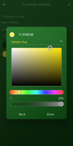

# Harpy

Harpy is a feature rich twitter experience built in [Flutter](https://flutter.dev/).

Currently still in development. See the [project](https://github.com/robertodoering/harpy/projects/1) for more information about the progress.

## Showcase
###### (Subject to change)

| Login | Setup |
| :---: | :---: |
| `login_screen.dart` | `setup_screen.dart` |
|  |  |


<details>
  <summary>More images</summary>
  
  | Home | User profile | Following |
  | :---: | :---: | :---: |
  |  |  |  |
  
  | | Custom theme | |
  | :---: | :---: | :---: |
  |  |  |  | 
  
</details>


## Development / Setup
Harpy is expected to be released in the PlayStore for Android, therefore only Android devices are used for testing the builds.

#### Twitter API key
Get your [Twitter API](https://developer.twitter.com/en/docs) key [here](https://developer.twitter.com/en/apply-for-access).

- Create a yaml file `app_config.yaml` in [`assets/config/`](assets/config) with the key and secret.
    ```yaml
    twitter:
      consumerKey: "your key"
      consumerSecret: "your secret"
    ```


#### Sentry
The [Sentry](https://sentry.io) error tracking service is used to report errors in release mode.
- The DSN provided by Sentry can be entered in the `app_config.yaml` in [`assets/config/`](assets/config).
    ```yaml
    sentry:
      dsn: "your dsn"
    ```

When omitted or left empty, errors are not sent to an error tracking service in release mode.

#### Misc

- To generate json_serializable models:
`flutter packages pub run build_runner build`

