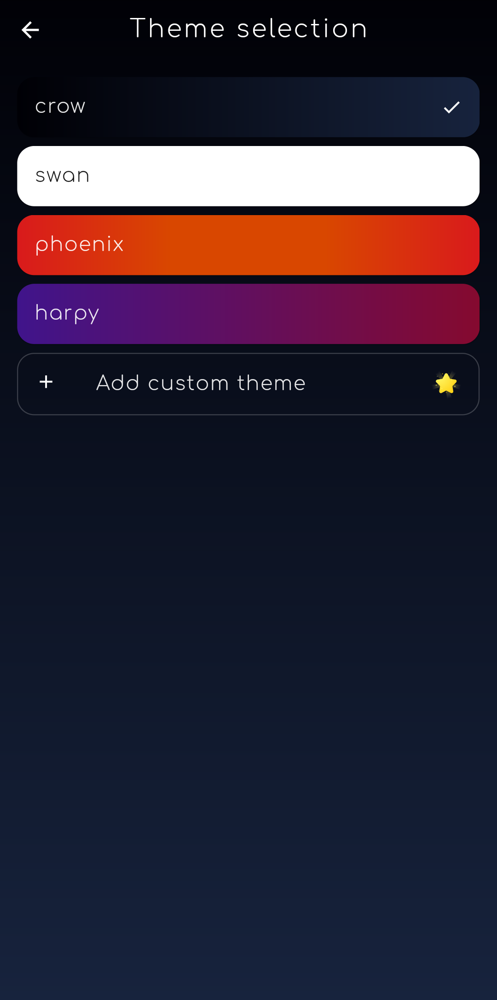

  

a feature rich Twitter experience built with <a href="https://flutter.dev/">Flutter</a>

  

 

  
  
  
  
  

  

Harpy is currently still in development. See the <a href="https://github.com/robertodoering/harpy/projects/1">project</a> for more
information about the progress.

 

  
  

  
More images

  
  | Home | User profile | Theme selection |
  | :---: | :---: | :---: |
  |  |  |  |

## About

This project aims to provide a good example for a medium-big sized Flutter app
in hopes that it will be useful for some.

Some interesting features of the app include:

* [flutter_bloc](https://pub.dev/packages/flutter_bloc) for the main state management.
* [get_it](https://pub.dev/packages/get_it) as a service provider that includes
  the ability to navigate and to show on screen messages from anywhere in the app.
* [firebase_analytics](https://pub.dev/packages/firebase_analytics) for
  analytics.
* [sentry](https://pub.dev/packages/sentry) as an online error tracking service
  where users can send a crash report when an exception has not been handled in
  the app.
* Fully featured theme customization.
* Fully featured video player using the
  [video_player](https://pub.dev/packages/video_player) package.
* A 'pro' and 'free' android
  [product flavor](https://developer.android.com/studio/build/build-variants).

## Development / Setup

Harpy is being released in the Play Store for Android, therefore only
Android devices are used for testing the builds.

### Twitter API key

Get your [Twitter API](https://developer.twitter.com/en/docs) key
[here](https://developer.twitter.com/en/apply-for-access).

### Building

The app can be built with the "free" or "pro" flavor by running:

* `flutter run --flavor free --dart-define=flavor=free --dart-define=twitter_consumer_key=your_consumer_key --dart-define=twitter_consumer_secret=your_consumer_secret`
* `flutter run --flavor pro --dart-define=flavor=pro --dart-define=twitter_consumer_key=your_consumer_key --dart-define=twitter_consumer_secret=your_consumer_secret`

### Misc

To generate [json_serializable](https://pub.dev/packages/json_serializable)
models:

* `flutter packages pub run build_runner build`
