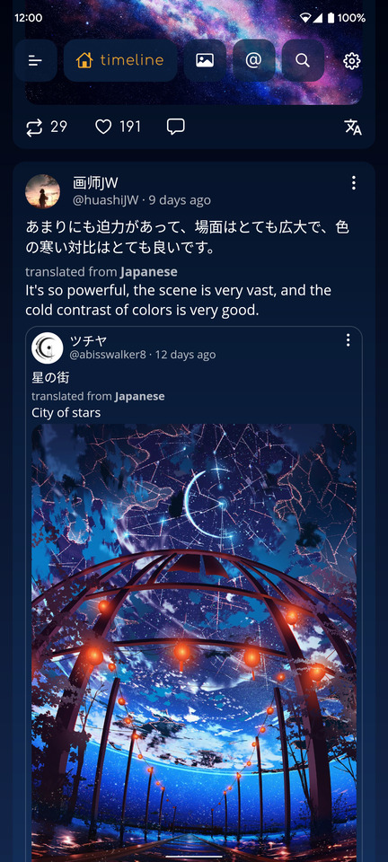
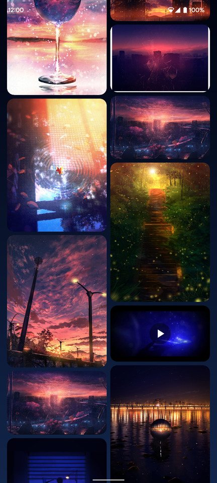
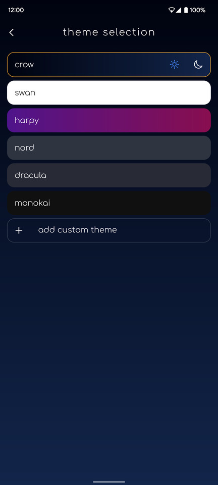
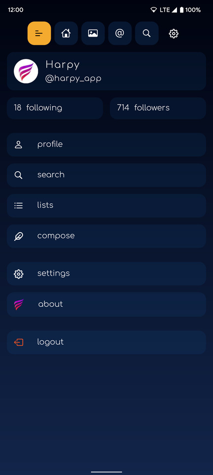
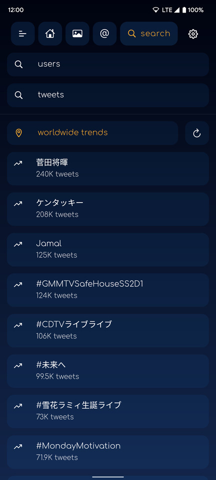
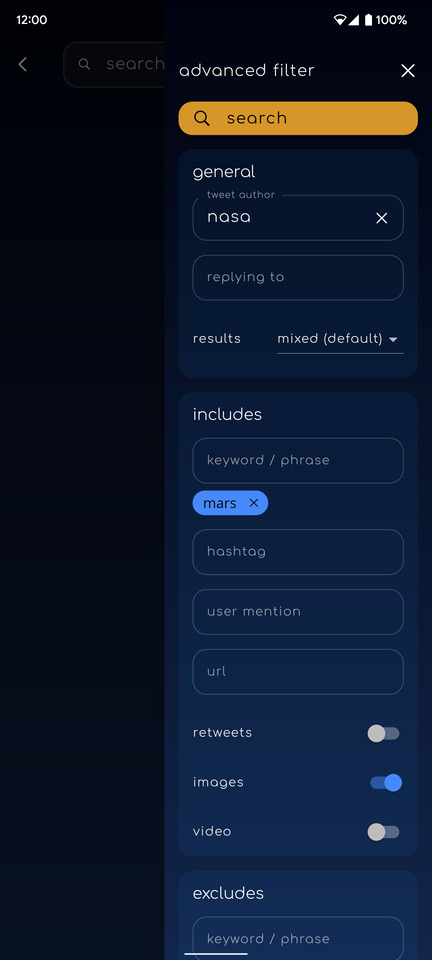

  

a feature rich Twitter experience built with <a href="https://flutter.dev/">Flutter</a>

  
 

  
  
  
  

  
  
  

 

harpy is no longer in active development after Twitter's decision to disallow third party Twitter clients.

harpy was available in the Play Store as a free and paid app and was used by over 75.000 active users.

 

  Check out a walkthrough of the app on youtube <a href="https://www.youtube.com/watch?v=egpQsNxLwvU" target="_blank">here</a>

 

  <kbd></kbd>
  <kbd></kbd>

  
More images

  
  | **Home** | **Media timeline** | **Theme selection** |
  | :---: | :---: | :---: |
  | <kbd></kbd> | <kbd></kbd> | <kbd></kbd> |
  | **Menu** | **Trends** | **Tweet search filter** |
  | <kbd></kbd> | <kbd></kbd> | <kbd></kbd> |

## About

**harpy** is an alternative Twitter client that focuses on a nice user experience with unique features.

This project has been in development since late 2018 and aims to be a good example for a medium-large sized Flutter app with a focus on code quality and maintainability.

Some interesting features of the app include:

* [riverpod](https://pub.dev/packages/riverpod)
  * for state management using the included [state_notifier](https://pub.dev/packages/state_notifier)
  * for dependency injection / service locators with easily mockable dependencies
* [go_router](https://pub.dev/packages/go_router) for routing with support for Twitter url deeplinks
* [sentry](https://pub.dev/packages/sentry) as an online error tracking service to report unhandled exceptions
* Fully featured theme customization
* Fully featured video player using the
  [video_player](https://pub.dev/packages/video_player) package
* My own [twitter_api](https://github.com/robertodoering/twitter_api) package to make use of the official Twitter api
* A 'pro' and 'free' android
  [product flavor](https://developer.android.com/studio/build/build-variants)
* Many customized animations sprinkled around the app, including custom logo animations created with [Rive](https://flare.rive.app/a/rbyd/files/recent/all)

### Development / Setup

Follow the [project setup for building harpy](https://github.com/robertodoering/harpy/wiki/Project-setup-for-building-harpy) instructions to get the project running.
